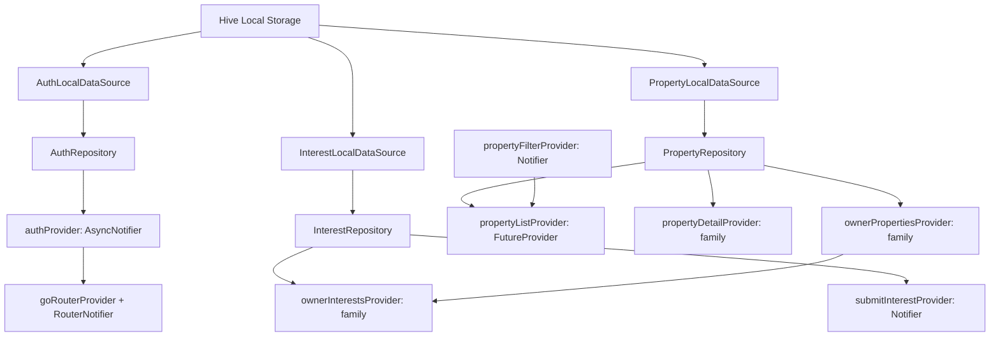

# PropertyApp — Architecture & Technical Design Document

This document outlines the software architecture, design patterns, data flow, state management, and persistence strategy for the **PropertyApp Property Application**.

---

## 1. Architectural Philosophy: Clean Architecture

The codebase strictly follows Uncle Bob's Clean Architecture principles, separating software into distinct concentric layers with inward-pointing dependencies:

```
lib/
├── main.dart
├── core/
│   ├── constants/               # Enums (PropertyType, PropertyStatus), formatters, box names
│   ├── di/                      # Hive service, local seed loader, composition root
│   ├── errors/                  # Failure definitions & domain errors
│   ├── router/                  # GoRouter declarative configuration with auth guard
│   ├── theme/                   # Modern luxury design system (dark & light themes)
│   └── widgets/                 # Reusable UI components (PropertyCard, EmptyState, ThemeToggle)
│
└── features/
    ├── auth/                    # Role-based authentication & session
    │   ├── domain/              # AppUser, AuthRepository interface
    │   ├── data/                # UserModel, AuthLocalDataSource (Hive), AuthRepositoryImpl
    │   └── presentation/        # authProvider, LoginScreen
    │
    ├── property/                # Property catalog, search & filtering
    │   ├── domain/              # Property, PropertyFilter, PropertyRepository interface
    │   ├── data/                # PropertyModel, PropertyLocalDataSource, PropertyRepositoryImpl
    │   └── presentation/        # propertyListProvider, UserDashboardScreen, PropertyDetailScreen, FilterSheet
    │
    ├── interest/                # Expression of interest submission
    │   ├── domain/              # InterestSubmission, InterestRepository interface
    │   ├── data/                # InterestModel, InterestLocalDataSource, InterestRepositoryImpl
    │   └── presentation/        # submitInterestProvider, ownerInterestsProvider, InterestFormScreen
    │
    └── owner_dashboard/         # Landlord / owner inquiry & inventory portal
        └── presentation/        # OwnerDashboardScreen (My Properties & Inquiries Stream)
```

### Dependency Rules:
1. **Domain Layer**: Completely pure Dart. Has no dependencies on Flutter, Hive, or Riverpod.
2. **Data Layer**: Implements repository interfaces defined in Domain. Handles Hive NoSQL operations and serialization.
3. **Presentation Layer**: Riverpod state notifiers, screens, and UI widgets that depend on Domain abstractions.
4. **Core Layer**: Shared cross-cutting concerns (theme, router, DI, errors, common widgets).

---

## 2. State Management & Dependency Injection: Riverpod

Riverpod (`flutter_riverpod`) acts as both the **state management engine** and the **dependency injection container**.

### Provider Graph:



---

## 3. Navigation & Route Authentication Guards: GoRouter

The routing system uses `go_router` with declarative, reactive auth-guard redirects driven by `authProvider`:

```
/login (Public)
  ├── Authenticated as 'user'  ──> Redirect to /user-dashboard
  └── Authenticated as 'owner' ──> Redirect to /owner-dashboard

/user-dashboard (Protected: 'user' role)
  ├── /property/:id (Property details & gallery)
  └── /interest/:id (Express interest inquiry form)

/owner-dashboard (Protected: 'owner' role)
  ├── Tab 1: My Properties (Inventory management)
  └── Tab 2: Inquiries (Incoming buyer leads with 1-tap contact)
```

If an unauthenticated user attempts to access `/user-dashboard`, `/property/:id`, or `/owner-dashboard`, they are automatically redirected to `/login`.

---

## 4. Local Persistence & Data Model (Hive)

The app operates 100% offline using Hive NoSQL boxes loaded with seed data from `assets/data/db.json` on initial boot:

| Box Name | Key | Value Schema |
|---|---|---|
| `users_box` | User ID (`u001`, `o001`) | `{ id, name, email, password, role }` |
| `properties_box` | Property ID (`p001` - `p011`) | `{ id, name, type, location, price, area, areaUnit, configuration, status, description, imagePlaceholder, ownerId }` |
| `owners_box` | Owner ID (`o001`, `o002`) | `{ id, name, contact }` |
| `interests_box` | Auto-generated ID (`int_timestamp`) | `{ id, propertyId, propertyName, name, mobile, email, message, submittedAt }` |

When a User submits an interest form, it writes directly to `interests_box`. When the relevant Property Owner opens `/owner-dashboard`, Riverpod queries the same box filtered by the owner's `propertyId`s, enabling real-time lead synchronization without a remote backend.

---

## 5. Multidimensional Search & Filtering Engine

The `PropertyFilter` entity supports simultaneous compound filtering across 7 dimensions:

```dart
class PropertyFilter {
  final String? keyword;        // Case-insensitive match across name, location, desc, config
  final String? location;       // Specific locality query
  final PropertyType? type;     // Apartment, Villa, Row House
  final RangeValues? priceRange;// Min / Max price slider (₹20L - ₹2Cr)
  final RangeValues? areaRange; // Min / Max area slider (500 - 5000 sqft)
  final PropertyStatus? status; // Available, Sold, Under Construction
  final String? configuration;  // 1BHK, 2BHK, 3BHK, 4BHK, 5BHK
}
```

---

## 6. Luxury Design System & Aesthetic Principles

1. **Dual Theme Architecture**:
   - **Dark Mode**: Midnight slate background (`#0B0F19`), surface card (`#131C2E`), borders (`#243248`), emerald/cyan accents (`#10B981` / `#14B8A6`).
   - **Light Mode**: Crisp surface (`#F8FAFC`), pure white cards (`#FFFFFF`), deep teal branding (`#0F766E`), navy slate typography (`#0F172A`).
2. **Micro-Interactions**:
   - Animated 360° rotation on the theme toggle button.
   - Real-time active filter badge indicator on the search toolbar.
   - One-tap clipboard copy feedback for phone and email on owner dashboard.
